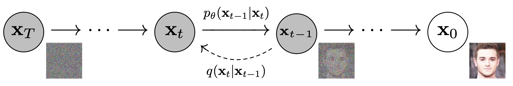
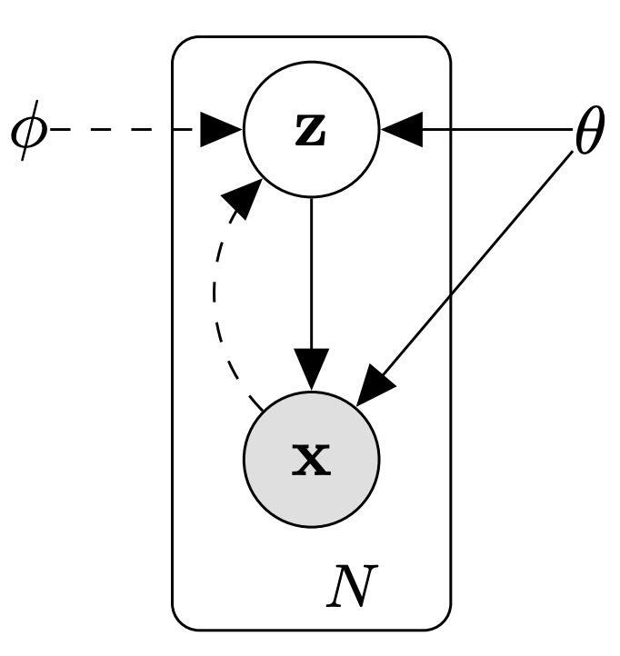
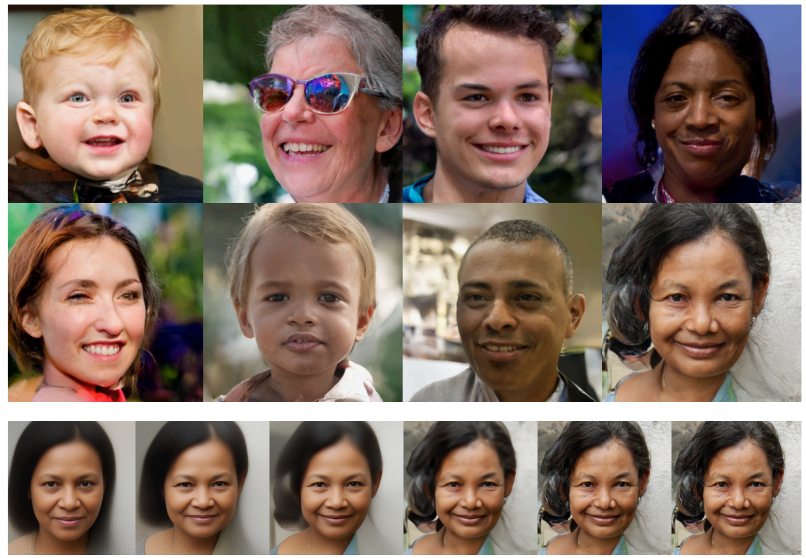
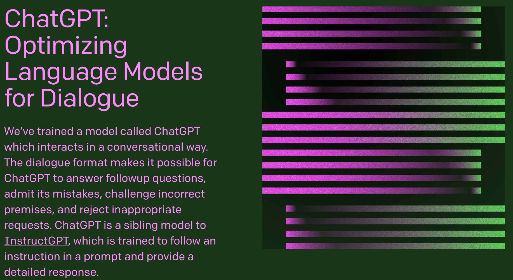

Probabilistic graphical models have numerous and diverse real-world applications. We provide an overview of the following applications of probabilistic graphical models, which are just a few examples of their many practical uses.

+ **Images**
  - [Generation](#image-generation)
  - [In-Painting](#image-inpainting)
  - [Denoising](#image-denoising)
  - [Models for Image Applications](#image-models)
+ **Language**
  - [Generation](#text-generation)
  - [Translation](#text-translation)
  - [Models for Language Applications](#language-models)
+ **Audio**
  - [Super-Resolution](#audio-superresolution)
  - [Speech Synthesis](#speech-synthesis)
  - [Speech Recognition](#speech-recognition)
+ **Economics**
  - [Causal Inference](#causal-inference)
+ **Science**
  - [Error-Correcting Codes](#error-correcting-codes)
  - [Computational Biology](#comp-bio)
  - [Ecology](#ecology)
  - [Economics](#economics)
+ **Health Care and Medicine**
  - [Diagnosis](#diagnosis)

## Probabilistic Models of Images

Consider a distribution $$p(\bfx)$$ over images, where $$\bfx$$ is an image represented as a vector of pixels, that assigns high probability to images that look realistic and low probability to everything else. Given such a model, we can solve a wide array of interesting tasks.

### Image Generation

[Radford et al.](https://arxiv.org/abs/1511.06434) trained a probabilistic model $$ p(\bfx) $$ that assigns high probability to images that look like bedrooms. To do so, they trained their model on a dataset of bedroom images, a sample of which is shown below:

**Training Data** 

Now that we have this probabilistic model of bedrooms, we can now _**generate**_ new realistic bedroom images by sampling from this distribution.  Specifically, new sampled images $$\hat{\mathbf{x}} \sim p(\mathbf{x})$$ are created directly from our model $$p(\mathbf{x})$$, which can now generate data similar to the bedroom images that we trained it with.

Moreover, one of the reasons why generative models are powerful lies in the fact that they have many fewer parameters than the amount of data that they are trained with --- as a result, the models have to efficiently distill the essence of the training data to be able to generate new samples.  We see that our particular probabilistic model of bedrooms has done a good job of capturing the data's essence, and can therefore produce highly realistic images, some examples of which are shown below:

**Generated Data** 

Similarly, we can learn a model for faces.

As with the bedroom images, these faces are completely synthetic --- these images are not of an actual person.

The same approach can be used for other objects.

Note that the images are not perfect and may need to be refined; however, sampling generates images that are very similar to what one might expect.

### In-Painting

Using the same $$p(\bfx)$$ for faces as before, we can also "fill in" the rest of an image. For example, given $$p(\bfx)$$ and a patch of an existing image (e.g., a piece of a photograph), we can sample from $$p(\textsf{image} \mid \textsf{patch})$$ and generate different possible ways of completing the image:

Note the importance of a probabilistic model that captures uncertainty: there could be multiple ways to complete the image!

### Image Denoising

Similarly, given an image corrupted by noise (e.g., an old photograph), we can attempt to restore it based on our probabilistic model of what images look like. Specifically, we want to generate a graphical model that does a good job at modeling the posterior distribution $$p(\textsf{original image} \mid \textsf{noisy image}).$$ Then, by observing the noisy image, we can sample or use exact inference to predict the original image.

### Models for Image Applications
Different variants of PGMs have been developed for the aforementioned image applications. Here we discuss two state-of-the art model families: diffusion models and variational autoencoders.

**Diffusion Models** 

Diffusion models are a class of PGMs that build upon the directed Markov chain structure to model a sequence of random variables, i.e [stochastic process](https://en.wikipedia.org/wiki/Stochastic_process), $$\{x_{t}\}_{t = 0}^{T}$$ where each $$x_{t}$$ represents an intermediate between a uniform random distribution and the data distribution. The Markov chain structure captures the key sparse independence assumptions between the variables and consequently enables efficient learning and inference. Diffusion models have been successfully leveraged for generating images of faces and natural scenaries:

Diffusion models are an active area of research. Some seminal works in the area include
- Denoising Diffusion Probablistic Models (DDPMs) by [Ho et al. 2020](https://arxiv.org/pdf/2006.11239.pdf)
- Score-based Generative Modeling through Stochastic Differential Equations by [Song et al. 2021](https://arxiv.org/pdf/2011.13456.pdf).

**Variational Autoencoders (VAE)** 

A Variational Autoencoder (VAE) is a simple PGM that has a directed edge between the latent (unobserved) variables $$z$$ and observed variables $$x$$. The observed variables $$x$$ represent the data distribution (such as the distribution of MNIST images) while the latents $$z$$ often represent a distinguishied semantatic characteristic of the data, e.g digit identity. VAEs have the additional use case for compression, i.e the latents $$z$$ can be interpreted as a compressed representations of the original images. VAEs can generate high fidelity images as shown below.

More details on the technical formulation of the VAE model can be found [here](../../extras/vae). Like Diffusion Models, VAEs are an active area of research and some seminal works in the area include:
- Autoencoding Variational Bayes by [Kingma et al. 2013](https://arxiv.org/pdf/1312.6114.pdf)
- Importance Weighted Autoencoders by [Burda et al. 2016](https://arxiv.org/pdf/1509.00519.pdf)
- Very Deep VAEs Generalize Autoregressive Models and Can Outperform Them on Images by [Child et al. 2021](https://arxiv.org/pdf/2011.10650.pdf)

## Language

Knowing the probability distribution can also help us model natural language utterances. In this case, we want to construct a probability distribution $$p(x)$$ over sequences of words or characters $$x$$ that assigns high probability to proper (English) sentences. This distribution can be learned from a variety of sources, such as Wikipedia articles.

### Generation

Let's say that we have constructed a distribution of word sequences from Wikipedia articles. We can then sample from this distribution to generate new Wikipedia-like articles like the one below.

> Naturalism and decision for the majority of Arab countries' capitalide was grounded
by the Irish language by [[John Clair]], [[An Imperial Japanese Revolt]], associated
with Guangzham's sovereignty. His generals were the powerful ruler of the Portugal
in the [[Protestant Immineners]], which could be said to be directly in Cantonese
Communication, which followed a ceremony and set inspired prison, training. The
emperor travelled back to [[Antioch, Perth, October 25|21]] to note, the Kingdom
of Costa Rica, unsuccessful fashioned the [[Thrales]], [[Cynth's Dajoard]], known
in western [[Scotland]], near Italy to the conquest of India with the conflict.
Copyright was the succession of independence in the slop of Syrian influence that
was a famous German movement based on a more popular servicious, non-doctrinal
and sexual power post. Many governments recognize the military housing of the
[[Civil Liberalization and Infantry Resolution 265 National Party in Hungary]],
that is sympathetic to be to the [[Punjab Resolution]]
(PJS)[http://www.humah.yahoo.com/guardian.
cfm/7754800786d17551963s89.htm Official economics Adjoint for the Nazism, Montgomery
was swear to advance to the resources for those Socialism's rule,
was starting to signing a major tripad of aid exile.]]

### Translation

Suppose that we have gathered a training set of paragraphs that were transcribed in both English and Chinese. We can build a probabilistic model $$p(y \mid x)$$ to generate an English sentence $$y$$ conditioned on the corresponding Chinese sentence $$x$$; this is an instance of *machine translation*.

### Models for Language Applications
Many modern language models do not make strong independence assumptions and instead learn a fully connected PGM with a large quantity of data in order to avoid overfitting. Recent successes in commerical language products such as [ChatGPT](https://openai.com/blog/chatgpt/) are based on the [Transformer Architecture](https://arxiv.org/pdf/1706.03762.pdf) which is a fully connected graphical model.

Some works in the area of language modeling include
- BERT: Pre-training of Deep Bidirectional Transformers for Language Understanding by [Devlin et al. 2019](https://arxiv.org/abs/1810.04805)
- XLNet: Generalized Autoregressive Pretraining for Language Understanding by [Yang et al. 2020](https://arxiv.org/pdf/1906.08237.pdf)

## Audio Models

We can also use probabilistic graphical models for audio applications. Suppose we construct a probability distribution $$p(x)$$ over audio signals that assigns high probability to ones that sound like human speech.

### Upsampling or Super-Resolution

Given a low resolution version of an audio signal, we can attempt to increase its resolution. We can formulate this problem as follows: given our speech probability distribution $$p(x)$$ that "knows" what typical human speech sounds like and some observed values of an audio signal, we aim to calculate signal values at intermediate time points.

In the diagram below, given observed audio signals (blue) and some underlying model of the audio, we aim to reconstruct a higher-fidelity version of the original signal (dotted line) by predicting intermediate signals (white).

We can solve this by sampling or performing inference on $$p(\textbf{I} \mid \textbf{O})$$, where $$\textbf{I}$$ are the intermediate signals that we want to predict, and $$\textbf{O}$$ are the observed low-resolution audio signals.

[Super resolution of audio signals demo](https://kuleshov.github.io/audio-super-res/)

### Speech synthesis

As we did in image processing, we can also sample the model and generate (synthesize) speech signals.

[Super resolution of audio signals demo](https://deepmind.com/blog/wavenet-generative-model-raw-audio/)

### Speech recognition
Given a (joint) model of speech signals and language (text), we can attempt to infer spoken words from audio signals.

## Economics

### Causal Inference

PGMs are used in the field of [Causal Inference](https://en.wikipedia.org/wiki/Causal_inference) to reason about when a set of variables $$X_{C}$$ have a "causal effect" on another set of variables $$X_{E}$$. This is done by modifying the original graphical model, e.g the figure above, so that all incoming directed edges to $$X_{C}$$ are removed. We say that $$X_{C}$$ has a causal effect on $$X_{E}$$ if setting $$X_{C}$$ to different values $$x_{c}, x_{c}'$$ leads to different conditional distributions for $$X_{E}$$ on the modified graph, i.e. $$p(X_{E} \vert X_{C} = x_{c}) \neq p(X_{E} \vert X_{C} = x_{c}')$$. Intuitively, this surgery on the graph corresponds to the process of shutting off the mechanisms that would ordinarily set $$X_{C}$$ and leaving the other mechanisms propagating out of $$X_{C}$$ on, which propagates the fixed values of $$X_{C}$$. More details can be found in this [write-up](https://www.stat.cmu.edu/~cshalizi/uADA/12/lectures/ch22.pdf). Some works in this field include
- Causal Effect Inference with Deep Latent-Variable Models by [Louizos et al. 2017](https://arxiv.org/pdf/1705.08821.pdf)

## Applications in Science Today

### Error Correcting Codes
In the non-theoretical world, probabilistic models are often used to model communication channels (e.g., Ethernet or Wifi). I.e., if you send a message over a channel, you might get something different on the other end due to noise. Error correcting codes and techniques based on graphical models are used to detect and correct communication errors.

### Computational Biology

Graphical models are also widely used in computational biology. For example, given a model of how DNA sequences evolve over time, it is possible to reconstruct a phylogenetic tree from DNA sequences of a given set of species.

### Ecology
Graphical models are used to study phenomena that evolve over space and time, capturing spatial and temporal dependencies. For example, they can be used to study bird migrations.

### Economics

Graphical models can be used to model spatial distributions of quantities of interests (e.g., assets or expenditures based measures of wealth).

The last two applications are what are known as spatio-temporal models. They depend on data that is collected across time as well as space.

## Applications in Health Care and Medicine

### Medical Diagnosis

Probabilistic graphical models can assist doctors in diagnosing diseases and predicting adverse outcomes. For example, in 1998 the LDS Hospital in Salt Lake City, Utah developed a Bayesian network for diagnosing pneumonia. Their model was able to distinguish patients with pneumonia from patients with other diseases with high sensitivity (0.95) and specificity (0.965), and was used for many years in the clinic. Their network model is outlined below:

You can read more about the development of their model [here](https://www.ncbi.nlm.nih.gov/pmc/articles/PMC2232064/).

 

|[Index](../../) | [Previous](../probabilityreview/) | [Next](../../representation/directed/)|
